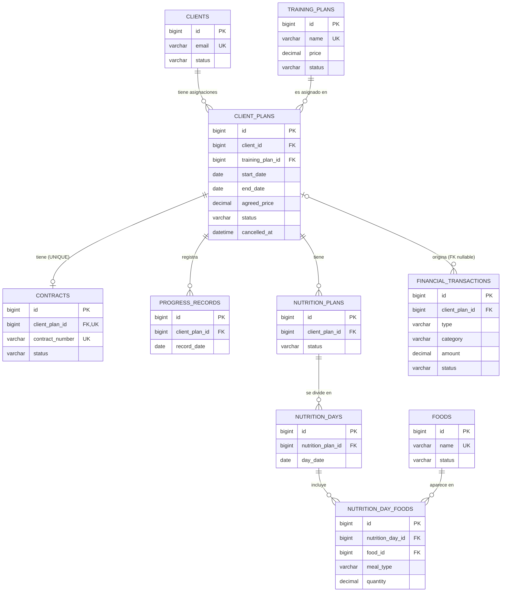

# FitCore Management System — Base de datos y modelo de dominio

Este documento describe **cómo está modelada y cómo se protege la información** en FitCore Management System, según el esquema `database/schema.sql` y el código que lo utiliza (`src/queries`, `src/repositories`, `src/services`, `src/validators`).

> [!NOTE]
> Documento *code-driven*: todo lo descrito proviene del esquema SQL y del código. Las secciones **Correcciones técnicas** y **Recomendaciones** están separadas de la **Implementación actual** y nunca la reemplazan.

Documentos relacionados: [README.md](./README.md) · [README-ARCHITECTURE.md](./README-ARCHITECTURE.md)

---

## Índice

1. [Introducción](#1-introducción)
2. [Modelo de dominio](#2-modelo-de-dominio)
3. [Tablas](#3-tablas)
4. [Índices](#4-índices)
5. [Relaciones](#5-relaciones)
6. [Integridad referencial y reglas](#6-integridad-referencial-y-reglas)
7. [Historial y estados](#7-historial-y-estados)
8. [Flujo de persistencia](#8-flujo-de-persistencia)
9. [Transacciones](#9-transacciones)
10. [Modelo entidad-relación](#10-modelo-entidad-relación)
11. [Decisiones de diseño](#11-decisiones-de-diseño)
12. [Inconsistencias o riesgos](#12-inconsistencias-o-riesgos)

---

## 1. Introducción

FitCore usa **MySQL** (motor **InnoDB**) con una única base de datos llamada `fitcore_management`, creada por `database/schema.sql`. Representa el negocio de un entrenador personal o gimnasio:

- **quién** es el cliente,
- **qué programas** de entrenamiento se ofrecen,
- **qué programa se le asignó a qué cliente, por cuánto tiempo y a qué precio** (la asignación es el centro del modelo),
- el **contrato**, el **progreso físico**, el **plan nutricional** y los **movimientos de dinero** asociados a esa asignación.

El script empieza con:

```sql
DROP DATABASE IF EXISTS fitcore_management;

CREATE DATABASE fitcore_management;

USE fitcore_management;
```

> [!WARNING]
> Ejecutar `schema.sql` **elimina la base de datos completa** si ya existe. Es un script de creación inicial, no una migración. Además, el nombre `fitcore_management` está fijo en el script; el valor `DB_NAME` del `.env` debe coincidir con él.

No existen `VIEW`, `TRIGGER`, `PROCEDURE` ni `FUNCTION` en el esquema: toda la lógica que no es una restricción declarativa vive en JavaScript.

---

## 2. Modelo de dominio

El sistema tiene **10 tablas** y cada una tiene su clase modelo en `src/models/`.

| Entidad (concepto) | Tabla | Clase JS | Depende de | Estados |
|---|---|---|---|---|
| Cliente | `clients` | `Client` | — | `ACTIVE`, `INACTIVE` |
| Plan de entrenamiento (catálogo) | `training_plans` | `TrainingPlan` | — | `ACTIVE`, `INACTIVE` |
| **Asignación de plan a cliente** | `client_plans` | `ClientPlan` | `clients`, `training_plans` | `ACTIVE`, `COMPLETED`, `CANCELLED`, `EXPIRED` |
| Contrato | `contracts` | `Contract` | `client_plans` | `ACTIVE`, `COMPLETED`, `CANCELLED`, `EXPIRED` |
| Registro de progreso | `progress_records` | `ProgressRecord` | `client_plans` | — (sin estado) |
| Plan nutricional | `nutrition_plans` | `NutritionPlan` | `client_plans` | `ACTIVE`, `INACTIVE`, `COMPLETED` |
| Día nutricional | `nutrition_days` | `NutritionDay` | `nutrition_plans` | — |
| Alimento (catálogo) | `foods` | `Food` | — | `ACTIVE`, `INACTIVE` |
| Alimento de un día | `nutrition_day_foods` | `NutritionDayFood` | `nutrition_days`, `foods` | — |
| Transacción financiera | `financial_transactions` | `FinancialTransaction` | `client_plans` (opcional) | `PENDING`, `COMPLETED`, `CANCELLED` |

### Descripción por entidad

**Cliente (`clients`)** — Persona atendida. Atributos: nombre, apellido, email (único), teléfono, fecha de nacimiento, género. No depende de nadie. Se "elimina" únicamente pasando a `INACTIVE`.

**Plan de entrenamiento (`training_plans`)** — Programa del catálogo: nombre (único), descripción, duración en semanas, objetivos físicos, nivel y **precio de lista**. No pertenece a ningún cliente.

**Asignación (`client_plans`)** — La entidad central. Vincula un cliente con un plan de entrenamiento en un rango de fechas, con un `agreed_price` (precio pactado, que puede diferir del precio de lista), un objetivo, y —si se cancela— fecha y motivo de cancelación. Es una **tabla intermedia con atributos propios** (relación N:M entre clientes y planes) y funciona como **historial**: un cliente acumula asignaciones con el tiempo.

**Contrato (`contracts`)** — Documento asociado a **una** asignación: número de contrato único, condiciones, fechas, precio y estado propio.

**Registro de progreso (`progress_records`)** — Medición física en una fecha (peso, % de grasa, cintura, pecho, brazo, pierna, foto, comentarios). Pertenece a una asignación, no directamente al cliente.

**Plan nutricional (`nutrition_plans`)** — Plan de alimentación con nombre, objetivo calórico diario opcional, fechas y estado. Pertenece a una asignación.

**Día nutricional (`nutrition_days`)** — Una fecha concreta dentro de un plan nutricional, con notas.

**Alimento (`foods`)** — Catálogo: nombre (único), calorías por 100 g, unidad (`g` por defecto), estado.

**Alimento de un día (`nutrition_day_foods`)** — Qué alimento se consume en qué comida (`BREAKFAST`, `SNACK`, `LUNCH`, `DINNER`) de un día, en qué cantidad y con cuántas calorías estimadas.

**Transacción financiera (`financial_transactions`)** — Ingreso o egreso con categoría, monto, fecha, método de pago, referencia y estado. Se puede vincular a una asignación **o no** (los gastos operativos no tienen asignación).

---

## 3. Tablas

Convención común: todas las claves primarias son `BIGINT UNSIGNED AUTO_INCREMENT`. Todas las tablas son `ENGINE=InnoDB`. Las columnas `status` son `VARCHAR(20)` con `CHECK`, no `ENUM`.

### 3.1 `clients`

| Columna | Tipo | Restricciones |
|---|---|---|
| `id` | BIGINT UNSIGNED | PK, AUTO_INCREMENT |
| `first_name` | VARCHAR(100) | NOT NULL |
| `last_name` | VARCHAR(100) | NOT NULL |
| `email` | VARCHAR(150) | NOT NULL · UNIQUE (`uq_clients_email`) |
| `phone` | VARCHAR(30) | NULL |
| `birth_date` | DATE | NULL |
| `gender` | VARCHAR(20) | NULL · `CHECK` ∈ {`MALE`,`FEMALE`,`OTHER`} o NULL |
| `status` | VARCHAR(20) | NOT NULL · DEFAULT `'ACTIVE'` · `CHECK` ∈ {`ACTIVE`,`INACTIVE`} |
| `created_at` | DATETIME | NOT NULL · DEFAULT `CURRENT_TIMESTAMP` |
| `updated_at` | DATETIME | NOT NULL · DEFAULT `CURRENT_TIMESTAMP` · `ON UPDATE CURRENT_TIMESTAMP` |

### 3.2 `training_plans`

| Columna | Tipo | Restricciones |
|---|---|---|
| `id` | BIGINT UNSIGNED | PK, AUTO_INCREMENT |
| `name` | VARCHAR(120) | NOT NULL · UNIQUE (`uq_training_plans_name`) |
| `description` | TEXT | NULL |
| `duration_weeks` | SMALLINT UNSIGNED | NOT NULL · `CHECK (duration_weeks > 0)` |
| `physical_goals` | TEXT | NULL |
| `level` | VARCHAR(20) | NOT NULL · `CHECK` ∈ {`BEGINNER`,`INTERMEDIATE`,`ADVANCED`} |
| `price` | DECIMAL(10,2) | NOT NULL · `CHECK (price >= 0)` |
| `status` | VARCHAR(20) | NOT NULL · DEFAULT `'ACTIVE'` · `CHECK` ∈ {`ACTIVE`,`INACTIVE`} |
| `created_at` / `updated_at` | DATETIME | igual que `clients` |

### 3.3 `client_plans`

| Columna | Tipo | Restricciones |
|---|---|---|
| `id` | BIGINT UNSIGNED | PK, AUTO_INCREMENT |
| `client_id` | BIGINT UNSIGNED | NOT NULL · FK → `clients(id)` |
| `training_plan_id` | BIGINT UNSIGNED | NOT NULL · FK → `training_plans(id)` |
| `start_date` | DATE | NOT NULL |
| `end_date` | DATE | NOT NULL · `CHECK (end_date >= start_date)` |
| `status` | VARCHAR(20) | NOT NULL · DEFAULT `'ACTIVE'` · `CHECK` ∈ {`ACTIVE`,`COMPLETED`,`CANCELLED`,`EXPIRED`} |
| `agreed_price` | DECIMAL(10,2) | NOT NULL · `CHECK (agreed_price >= 0)` |
| `goal` | TEXT | NULL |
| `cancelled_at` | DATETIME | NULL |
| `cancellation_reason` | VARCHAR(255) | NULL |
| `created_at` / `updated_at` | DATETIME | igual que `clients` |

Restricción de cancelación, tal como está en el esquema:

```sql
CONSTRAINT chk_client_plans_cancellation
    CHECK (
        (status = 'CANCELLED' AND cancelled_at IS NOT NULL)
        OR
        (status <> 'CANCELLED' AND cancelled_at IS NULL)
    ),
```

Significa: **`cancelled_at` tiene valor si y solo si el estado es `CANCELLED`**. El motivo (`cancellation_reason`) **no** está cubierto por este `CHECK`; lo controla el validador (ver §6).

FK: `fk_client_plans_client` y `fk_client_plans_training_plan`, ambas `ON UPDATE CASCADE ON DELETE RESTRICT`.

### 3.4 `contracts`

| Columna | Tipo | Restricciones |
|---|---|---|
| `id` | BIGINT UNSIGNED | PK, AUTO_INCREMENT |
| `client_plan_id` | BIGINT UNSIGNED | NOT NULL · FK → `client_plans(id)` · UNIQUE (`uq_contracts_client_plan`) |
| `contract_number` | VARCHAR(50) | NOT NULL · UNIQUE (`uq_contracts_number`) |
| `conditions` | TEXT | NOT NULL |
| `start_date` | DATE | NOT NULL |
| `end_date` | DATE | NOT NULL · `CHECK (end_date >= start_date)` |
| `price` | DECIMAL(10,2) | NOT NULL · `CHECK (price >= 0)` |
| `status` | VARCHAR(20) | NOT NULL · DEFAULT `'ACTIVE'` · `CHECK` ∈ {`ACTIVE`,`COMPLETED`,`CANCELLED`,`EXPIRED`} |
| `created_at` / `updated_at` | DATETIME | igual que `clients` |

FK `fk_contracts_client_plan`: `ON UPDATE CASCADE ON DELETE RESTRICT`.

### 3.5 `progress_records`

| Columna | Tipo | Restricciones |
|---|---|---|
| `id` | BIGINT UNSIGNED | PK, AUTO_INCREMENT |
| `client_plan_id` | BIGINT UNSIGNED | NOT NULL · FK → `client_plans(id)` |
| `record_date` | DATE | NOT NULL |
| `weight_kg` | DECIMAL(5,2) | NULL · `CHECK` NULL o `> 0` |
| `body_fat_percentage` | DECIMAL(5,2) | NULL · `CHECK` NULL o entre 0 y 100 |
| `waist_cm`, `chest_cm`, `arm_cm`, `leg_cm` | DECIMAL(6,2) | NULL · `CHECK` NULL o `> 0` |
| `photo_url` | VARCHAR(500) | NULL |
| `comments` | TEXT | NULL |
| `created_at` | DATETIME | NOT NULL · DEFAULT `CURRENT_TIMESTAMP` (**no** tiene `updated_at`) |

Único compuesto: `(client_plan_id, record_date)` → un registro por asignación y fecha. FK `fk_progress_client_plan`: `CASCADE` / `RESTRICT`.

### 3.6 `nutrition_plans`

| Columna | Tipo | Restricciones |
|---|---|---|
| `id` | BIGINT UNSIGNED | PK, AUTO_INCREMENT |
| `client_plan_id` | BIGINT UNSIGNED | NOT NULL · FK → `client_plans(id)` |
| `name` | VARCHAR(120) | NOT NULL |
| `description` | TEXT | NULL |
| `daily_calorie_target` | DECIMAL(8,2) | NULL · `CHECK` NULL o `> 0` |
| `start_date` | DATE | NOT NULL |
| `end_date` | DATE | NOT NULL · `CHECK (end_date >= start_date)` |
| `status` | VARCHAR(20) | NOT NULL · DEFAULT `'ACTIVE'` · `CHECK` ∈ {`ACTIVE`,`INACTIVE`,`COMPLETED`} |
| `created_at` / `updated_at` | DATETIME | igual que `clients` |

FK `fk_nutrition_plans_client_plan`: `CASCADE` / `RESTRICT`.

### 3.7 `nutrition_days`

| Columna | Tipo | Restricciones |
|---|---|---|
| `id` | BIGINT UNSIGNED | PK, AUTO_INCREMENT |
| `nutrition_plan_id` | BIGINT UNSIGNED | NOT NULL · FK → `nutrition_plans(id)` |
| `day_date` | DATE | NOT NULL |
| `notes` | TEXT | NULL |

Único compuesto: `(nutrition_plan_id, day_date)`. FK `fk_nutrition_days_plan`: `CASCADE` / `RESTRICT`. No tiene columnas de auditoría (`created_at`/`updated_at`).

### 3.8 `foods`

| Columna | Tipo | Restricciones |
|---|---|---|
| `id` | BIGINT UNSIGNED | PK, AUTO_INCREMENT |
| `name` | VARCHAR(150) | NOT NULL · UNIQUE (`uq_foods_name`) |
| `calories_per_100g` | DECIMAL(8,2) | NULL · `CHECK` NULL o `>= 0` |
| `unit` | VARCHAR(30) | NOT NULL · DEFAULT `'g'` |
| `status` | VARCHAR(20) | NOT NULL · DEFAULT `'ACTIVE'` · `CHECK` ∈ {`ACTIVE`,`INACTIVE`} |
| `created_at` / `updated_at` | DATETIME | igual que `clients` |

### 3.9 `nutrition_day_foods`

| Columna | Tipo | Restricciones |
|---|---|---|
| `id` | BIGINT UNSIGNED | PK, AUTO_INCREMENT |
| `nutrition_day_id` | BIGINT UNSIGNED | NOT NULL · FK → `nutrition_days(id)` |
| `food_id` | BIGINT UNSIGNED | NOT NULL · FK → `foods(id)` |
| `meal_type` | VARCHAR(20) | NOT NULL · `CHECK` ∈ {`BREAKFAST`,`SNACK`,`LUNCH`,`DINNER`} |
| `quantity` | DECIMAL(8,2) | NOT NULL · `CHECK (quantity > 0)` |
| `estimated_calories` | DECIMAL(8,2) | NULL · `CHECK` NULL o `>= 0` |
| `notes` | TEXT | NULL |

FKs `fk_nutrition_day_foods_day` y `fk_nutrition_day_foods_food`: `CASCADE` / `RESTRICT`. Sin columnas de auditoría.

### 3.10 `financial_transactions`

| Columna | Tipo | Restricciones |
|---|---|---|
| `id` | BIGINT UNSIGNED | PK, AUTO_INCREMENT |
| `client_plan_id` | BIGINT UNSIGNED | **NULL permitido** · FK → `client_plans(id)` |
| `type` | VARCHAR(20) | NOT NULL · `CHECK` ∈ {`INCOME`,`EXPENSE`} |
| `category` | VARCHAR(30) | NOT NULL · `CHECK` ∈ {`MEMBERSHIP`,`PERSONAL_SESSION`,`SERVICES`,`SUPPLEMENTS`,`OPERATING`,`OTHER`} |
| `amount` | DECIMAL(10,2) | NOT NULL · `CHECK (amount > 0)` |
| `transaction_date` | DATETIME | NOT NULL |
| `payment_method` | VARCHAR(30) | NULL · `CHECK` NULL o ∈ {`CASH`,`CARD`,`TRANSFER`,`OTHER`} |
| `description` | VARCHAR(255) | NULL |
| `reference` | VARCHAR(100) | NULL |
| `status` | VARCHAR(20) | NOT NULL · DEFAULT `'COMPLETED'` · `CHECK` ∈ {`PENDING`,`COMPLETED`,`CANCELLED`} |
| `created_at` | DATETIME | NOT NULL · DEFAULT `CURRENT_TIMESTAMP` (sin `updated_at`) |

FK `fk_financial_transactions_client_plan`: `CASCADE` / `RESTRICT`.

> [!NOTE]
> El monto siempre es positivo (`amount > 0`); el **signo económico lo da `type`** (`INCOME`/`EXPENSE`), no el valor numérico.

> [!NOTE]
> Las restricciones `CHECK` solo se **aplican** en MySQL ≥ 8.0.16. En versiones anteriores se aceptan en la sintaxis pero se ignoran, y el modelo perdería buena parte de su protección.

---

## 4. Índices

| Tabla | Índice | Tipo | Columnas |
|---|---|---|---|
| `clients` | `uq_clients_email` | UNIQUE | `email` |
| `clients` | `idx_clients_last_name` | normal | `last_name` |
| `training_plans` | `uq_training_plans_name` | UNIQUE | `name` |
| `client_plans` | `idx_client_plans_training_plan` | normal | `training_plan_id` |
| `client_plans` | `idx_client_plans_client_status` | normal | `client_id, status` |
| `contracts` | `uq_contracts_client_plan` | UNIQUE | `client_plan_id` |
| `contracts` | `uq_contracts_number` | UNIQUE | `contract_number` |
| `contracts` | `idx_contracts_status` | normal | `status` |
| `progress_records` | `uq_progress_client_plan_date` | UNIQUE | `client_plan_id, record_date` |
| `nutrition_plans` | `idx_nutrition_plans_client_status` | normal | `client_plan_id, status` |
| `nutrition_days` | `uq_nutrition_days_plan_date` | UNIQUE | `nutrition_plan_id, day_date` |
| `foods` | `uq_foods_name` | UNIQUE | `name` |
| `nutrition_day_foods` | `idx_nutrition_day_foods_food` | normal | `food_id` |
| `financial_transactions` | `idx_financial_client_date` | normal | `client_plan_id, transaction_date` |
| `financial_transactions` | `idx_financial_date_type` | normal | `transaction_date, type` |

Varios índices coinciden con consultas reales: `findActiveByClientId` usa `client_id` + `status`; `findByClientPlanId` de financieras ordena por `transaction_date`.

---

## 5. Relaciones

| Relación | Cardinalidad | Cómo se implementa |
|---|---|---|
| `clients` → `client_plans` | 1 : N | FK `client_plans.client_id` |
| `training_plans` → `client_plans` | 1 : N | FK `client_plans.training_plan_id` |
| `clients` ↔ `training_plans` | **N : M** | tabla intermedia `client_plans` (con atributos propios) |
| `client_plans` → `contracts` | **1 : 0..1** | FK `contracts.client_plan_id` + índice **UNIQUE** |
| `client_plans` → `progress_records` | 1 : N | FK; único por `(client_plan_id, record_date)` |
| `client_plans` → `nutrition_plans` | 1 : N | FK `nutrition_plans.client_plan_id` |
| `nutrition_plans` → `nutrition_days` | 1 : N | FK; único por `(nutrition_plan_id, day_date)` |
| `nutrition_days` ↔ `foods` | **N : M** | tabla intermedia `nutrition_day_foods` (con `meal_type`, `quantity`, `estimated_calories`, `notes`) |
| `client_plans` → `financial_transactions` | 0..1 : N | FK **nullable** `financial_transactions.client_plan_id` |

Puntos a destacar:

- **La asignación es el eje.** Contrato, progreso, nutrición y finanzas cuelgan de `client_plans`, **no** de `clients`. Para llegar del cliente a su progreso hay que pasar por la asignación.
- El **1:1 de contrato** no se declara con una PK compartida, sino con un índice único sobre la FK.
- `nutrition_day_foods` **no** tiene un índice único sobre `(nutrition_day_id, food_id, meal_type)`, por lo que el mismo alimento puede repetirse en la misma comida del mismo día.
- No hay relación directa entre `contracts` y `financial_transactions`.

---

## 6. Integridad referencial y reglas

Hay dos niveles de protección y es importante no confundirlos.

### 6.1 Reglas de base de datos (SQL)

| Mecanismo | Qué garantiza |
|---|---|
| FK con `ON DELETE RESTRICT` (todas) | No se puede borrar un registro padre que tenga hijos |
| FK con `ON UPDATE CASCADE` (todas) | Un cambio de PK se propaga a los hijos |
| `UNIQUE` | Email de cliente, nombre de plan, nombre de alimento, número de contrato, un contrato por asignación, un progreso por asignación+fecha, un día por plan+fecha |
| `CHECK` de dominio | Estados, géneros, niveles, categorías, tipos, métodos de pago, tipos de comida |
| `CHECK` numéricos | Precios `>= 0`, montos `> 0`, duraciones `> 0`, cantidades `> 0`, % de grasa entre 0 y 100, medidas `> 0` |
| `CHECK` de fechas | `end_date >= start_date` en `client_plans`, `contracts`, `nutrition_plans` |
| `CHECK` de cancelación | `cancelled_at` presente ⇔ estado `CANCELLED` |
| `NOT NULL` / `DEFAULT` | Campos obligatorios y estados iniciales |

### 6.2 Reglas de negocio implementadas en JavaScript

Estas **no** existen en el esquema; las aplican los *services* (`src/services`) consultando antes de escribir:

| Regla | Dónde |
|---|---|
| Un cliente no puede tener **dos asignaciones `ACTIVE`** a la vez | `ClientPlanService.create` y `update` |
| Solo se asigna un plan a un cliente **existente y `ACTIVE`** | `ClientPlanService.create` |
| Solo se asigna un plan de entrenamiento **existente y `ACTIVE`** | `ClientPlanService.create` y `update` |
| No se crea contrato / plan nutricional / progreso sobre una asignación `CANCELLED` | `ContractService`, `NutritionPlanService`, `ProgressRecordService` |
| Una asignación no se cancela dos veces | `ClientPlanService.cancel` |
| Un alimento asignado a un día debe existir y estar `ACTIVE` | `NutritionDayFoodService.create` / `update` |
| No se desactiva dos veces un cliente, plan de entrenamiento o alimento | `deactivate` de cada service |
| Email / nombre de plan únicos (con mensaje amigable) | `ClientService`, `TrainingPlanService` |
| Contrato único por asignación (mensaje amigable) | `ContractService.create` |
| Progreso único por asignación+fecha (mensaje amigable) | `ProgressRecordService` |

### 6.3 Reglas de validación de entrada (JavaScript, antes del service)

Los *validators* (`src/validators`) reproducen buena parte de los `CHECK` en JavaScript (estados, montos, rangos de fechas, porcentajes) y añaden reglas que el SQL no tiene, por ejemplo: `cancellationReason` **obligatorio** si el estado es `CANCELLED` y **prohibido** en cualquier otro (`validateCancellationConsistency`).

> [!IMPORTANT]
> Varias reglas existen **dos veces** (validator + `CHECK`). La duplicación es deliberada en la práctica: el validator produce un mensaje claro en español antes de llegar a MySQL, y el `CHECK` sigue protegiendo cualquier escritura que no pase por la aplicación.

> [!NOTE]
> Para reglas con `UNIQUE` en SQL **y** verificación previa en el service (email, nombre de plan, contrato, progreso), el service da el mensaje amigable y el índice único es la garantía final. Para `foods.name`, `nutrition_days (plan, fecha)` y `contracts.contract_number` en `update`, **no** hay verificación previa: el error lo produce MySQL (ver §12).

---

## 7. Historial y estados

**No hay borrado físico de entidades principales.** El código solo tiene una sentencia `DELETE`: `nutritionDayFoodQueries.delete` (detalle de comida de un día). Todo lo demás se conserva.

| Entidad | Mecanismo de "baja" | Consulta |
|---|---|---|
| Cliente | `status = 'INACTIVE'` | `clientQueries.deactivate` |
| Plan de entrenamiento | `status = 'INACTIVE'` | `trainingPlanQueries.deactivate` |
| Alimento | `status = 'INACTIVE'` | `foodQueries.deactivate` |
| Asignación | `status = 'CANCELLED'` + `cancelled_at` + `cancellation_reason` | `clientPlanQueries.cancel` |
| Contrato | cambio de `status` | `contractQueries.updateStatus` |
| Plan nutricional | cambio de `status` | `nutritionPlanQueries.updateStatus` |
| Transacción | cambio de `status` (`CANCELLED`) | `financialTransactionQueries.updateStatus` |

**Por qué no deben borrarse físicamente:** las FK `ON DELETE RESTRICT` impiden borrar un cliente o plan con asignaciones. Y el modelo está pensado como **histórico**: `client_plans` guarda precio pactado, fechas y motivo de cancelación de cada etapa; contratos, progreso y pagos cuelgan de esa asignación. Borrar el cliente o el plan destruiría el registro contable y de progreso. Por eso desactivar es la operación prevista.

**Asignaciones como línea de tiempo.** Un cliente puede tener muchas filas en `client_plans` (p. ej. una `COMPLETED` y luego una `ACTIVE`); solo puede haber **una `ACTIVE`** (regla de servicio). El seed (`tests/models/seed-data.js`) reproduce justamente ese escenario.

**`agreed_price` frente a `training_plans.price`.** El precio se **copia** a la asignación: si el precio del catálogo cambia después, las asignaciones antiguas conservan lo pactado.

**Reactivación.** No existe ninguna consulta ni método para volver un cliente, plan de entrenamiento o alimento a `ACTIVE` (solo `deactivate`).

---

## 8. Flujo de persistencia

Cada operación de escritura recorre las mismas capas:

```text
Entrada (menú CLI, inquirer)
   ↓
Command (src/commands)
   ↓
Validator  →  valida forma/tipos y normaliza
   ↓
Service    →  reglas de negocio (lecturas previas)
   ↓
Repository →  connection.execute(query, [parámetros])
   ↓
SQL        →  constante en src/queries (con placeholders ?)
   ↓
MySQL (restricciones CHECK / UNIQUE / FK)
```

Ejemplo real de las capas inferiores para crear un cliente:

```js
// src/queries/clientQueries.js
create: `
    INSERT INTO clients
        (first_name, last_name, email, phone, birth_date, gender)
    VALUES
        (?, ?, ?, ?, ?, ?)
`,
```

```js
// src/repositories/ClientRepository.js
static async create(client, connection = pool) {
    const [result] = await connection.execute(
        clientQueries.create,
        [
            client.firstName,
            client.lastName,
            client.email,
            client.phone,
            client.birthDate,
            client.gender
        ]
    );

    return result.insertId;
}
```

Observaciones:

- Todas las consultas usan **sentencias preparadas** (`?` + arreglo de parámetros): los valores nunca se concatenan al SQL.
- `INSERT` devuelve `insertId`; `UPDATE` devuelve `affectedRows` (ver §12 sobre lo que muestra la CLI).
- `status`, `created_at` y `updated_at` **no** se envían en el `INSERT` de `clients`, `training_plans`, `foods`: los pone MySQL con sus `DEFAULT`. En cambio `client_plans`, `contracts`, `nutrition_plans` y `financial_transactions` **sí** envían `status` explícitamente.
- Las columnas snake_case de SQL se traducen a camelCase en el repository (`mapRowToClient`, etc.), que devuelve instancias de las clases de `src/models`.
- `mysql2` devuelve por defecto `DATE` como objeto `Date` y `DECIMAL` como `string`; el pool no configura `dateStrings` ni `decimalNumbers`, así que los modelos hidratados los reciben así. (Comportamiento por defecto de la librería.)

---

## 9. Transacciones

> [!IMPORTANT]
> **No existen transacciones en el proyecto.** No hay `beginTransaction`, `commit`, `rollback` ni `getConnection` en el código.

Lo que sí existe: **todos los repositories aceptan un parámetro `connection = pool`**. Es un punto de extensión listo para pasar una conexión transaccional, pero hoy nadie lo usa: siempre se ejecuta sobre el pool.

Por qué el sistema funciona sin transacciones:

- Cada *command* escribe en **una sola tabla con una sola sentencia**, que InnoDB ya ejecuta de forma atómica.
- No hay operaciones compuestas (p. ej. "cancelar asignación **y** cancelar su contrato").

Qué queda expuesto:

- Los services hacen **verificar y luego escribir** en pasos separados (`SELECT` … `INSERT`) sin bloqueo. Dos ejecuciones concurrentes podrían pasar ambas la verificación.
  - Donde hay `UNIQUE` (email, contrato por asignación, progreso por fecha, etc.), la segunda falla en MySQL (con mensaje técnico).
  - Donde **no** hay respaldo en la base de datos —**"una sola asignación `ACTIVE` por cliente"**— la carrera podría dejar dos asignaciones activas.
- Ante un error, no hay nada que revertir (es una sola sentencia); el error se propaga hasta el menú, que lo imprime.

---

## 10. Modelo entidad-relación

Reconstruido exclusivamente desde las FK y los índices únicos de `schema.sql`:



> [!NOTE]
> El repositorio incluye además `docs/database/FitCore.svg` y `docs/database/Workbench_ER.png` (diagrama de MySQL Workbench). Este documento se basó en `schema.sql`; esas imágenes no se usaron como fuente.

---

## 11. Decisiones de diseño

Lo que puede deducirse del esquema (la intención del autor no se declara; se describe el efecto):

1. **`client_plans` como tabla intermedia rica.** Convierte la relación cliente–plan en historial con precio, fechas y cancelación propios.
2. **Colgar todo de la asignación.** Contrato, progreso, nutrición y finanzas heredan el contexto "qué plan, en qué periodo". Efecto: datos de un cliente separados por etapa.
3. **`ON DELETE RESTRICT` en todas las FK.** Coherente con la baja lógica: la base de datos misma impide borrar historial.
4. **Estados como `VARCHAR` + `CHECK`** en vez de `ENUM` o tablas de catálogo. El código repite las listas de valores en los validators.
5. **`agreed_price` copiado.** Desacopla lo pactado del precio de catálogo.
6. **`financial_transactions.client_plan_id` opcional.** Permite registrar gastos operativos sin cliente en la misma tabla que los ingresos (`type`).
7. **Contrato 1:0..1 con la asignación**, mediante índice único.
8. **`CHECK` de cancelación acoplando `status` y `cancelled_at`.** Impide una asignación "cancelada sin fecha" o "activa con fecha de cancelación".
9. **Tablas de detalle sin auditoría** (`nutrition_days`, `nutrition_day_foods`) y tablas de solo-inserción con únicamente `created_at` (`progress_records`, `financial_transactions`).
10. **Sin motor de reglas en SQL** (sin triggers/procedimientos): las reglas de negocio están en la capa de servicios.

---

## 12. Inconsistencias o riesgos

Son observaciones sobre lo que existe hoy; **no** son cambios aplicados al proyecto.

> [!WARNING]
> **La regla "una sola asignación `ACTIVE` por cliente" no tiene respaldo en la base de datos.**
> El único índice relacionado es `idx_client_plans_client_status (client_id, status)`, que **no es único** (y no puede serlo, porque un cliente puede tener muchas asignaciones no activas). La regla vive solo en `ClientPlanService`. Una escritura fuera de la aplicación, o dos operaciones concurrentes, pueden violarla.
> *Recomendación (no implementada):* respaldarla en SQL (por ejemplo con una columna generada + índice único) o ejecutar verificación y escritura dentro de una transacción con bloqueo.

> [!WARNING]
> **Estados independientes entre entidades.** `contracts.status` no está sincronizado con `client_plans.status`. Cancelar una asignación (`ClientPlanRepository.cancel`) **no** modifica su contrato, sus planes nutricionales, ni sus transacciones. La única propagación es hacia adelante: no se pueden **crear** nuevos hijos sobre una asignación cancelada. Además, `ClientPlanService.cancel` solo rechaza asignaciones ya `CANCELLED`, por lo que también permite cancelar asignaciones `COMPLETED` o `EXPIRED`.

Otros puntos:

- **Coherencia de fechas entre niveles no se valida.** Solo se exige `end >= start` dentro de cada tabla. Nada verifica que las fechas del contrato coincidan con las de la asignación, que el periodo de un plan nutricional esté dentro de la asignación, que `day_date` caiga dentro del plan nutricional, ni que `record_date` esté dentro de la asignación. Tampoco se compara `end_date - start_date` con `training_plans.duration_weeks`.
- **Precios no reconciliados.** `contracts.price` y `client_plans.agreed_price` son columnas independientes, y ninguna transacción financiera está ligada a un contrato ni se compara con esos montos.
- **`estimated_calories` es un dato ingresado**, no calculado. Puede contradecir `quantity × calories_per_100g` (que sí sería derivable). Además `foods.unit` es configurable pero la columna se llama `calories_per_100g`, por lo que una unidad distinta de `g` haría ambiguo el significado.
- **Duplicados posibles en `nutrition_day_foods`**: sin índice único por `(nutrition_day_id, food_id, meal_type)`.
- **`cancellation_reason` sin `CHECK`** de coherencia con el estado; solo lo controla `ClientPlanValidator`. Tampoco hay validación de longitud (columna `VARCHAR(255)`), ni en `phone`, `photo_url`, `reference`, `description`: un valor demasiado largo lo rechazará MySQL (en modo estricto) con un mensaje técnico.
- **Mensajes técnicos de MySQL** para `foods.name` duplicado, `nutrition_days` (plan, fecha) duplicado y `contracts.contract_number` duplicado al **actualizar**: no hay verificación previa en el service.
- **`ClientPlanRepository.update` sobrescribe `cancelled_at` y `cancellation_reason`** con lo que reciba; la consistencia depende del validator y del `CHECK` de cancelación.
- **Datos de contacto:** `email` es único, pero el código lo normaliza a minúsculas; `phone` no tiene formato validado.
- **Sin reactivación** de clientes, planes de entrenamiento o alimentos inactivos (ver §7).
- **Descripción de esquema y seed:** `schema.sql` no incluye datos iniciales; los datos de ejemplo salen de `npm run seed`, que inserta usando la capa de aplicación (ver [README-ARCHITECTURE.md](./README-ARCHITECTURE.md#12-pruebas)).